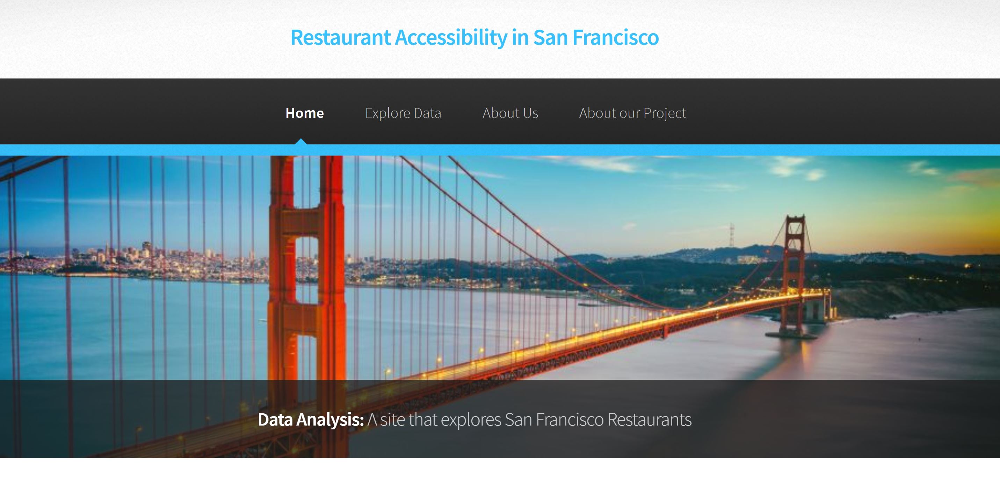
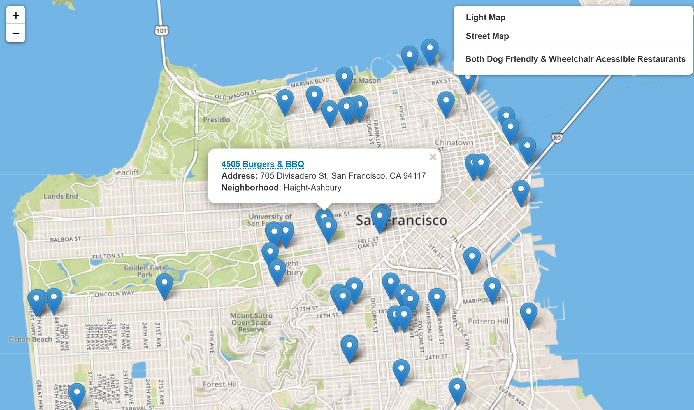

# Restaurant Accessibility in San Francisco

## Project Scope
In SF, there seems to be more dogs than kids. In 2016, there were about 115,000 children (under the age of 18) vs. 120,000-150,000 dogs living in the city. (Source: American Community Survey, SF Animal Care, KQED News). 

We want to see which restaurants allow dogs in SF and if certain neighborhoods in SF have more dog friendly restaurants than other areas. We are also interested in seeing if there is a correlation between dog friendly restaurants and wheel-chair accessible restaurants.

We were inspired to pursue this topic because we realized that accessibility is an issue for many people, and those who are in wheelchairs are likely to be the most heavily impacted. When you compound that with the idea that they might need comfort dogs, which do not count as service dogs under the ADA, their options for dining locations become even more limited. We wanted to find out which restaurants are the most accessible for this group of people.

After collecting the necessary data and doing appropriate analysis, we created an app for users to easily access the information we gathered. 

In the web app, there will be three main visualizations for user exploration:

1. An interactive map (Leaflet)
   - The user can access the restaurant’s website by clicking on the restaurant name in the pop-up
   - Map displays San Francisco Restaurants that are both dog and wheelchair friendly
   - The pop-up also displays the restaurant's address and neighborhood

     

2. Interactive word clouds (Anychart)
   - There are three word clouds showing the following:
     - Dog friendly restaurant frequency by neighborhood
     - Wheelchair accessible restaurant frequency by neighborhood
     - Frequency of restaurants that are both dog friendly and wheelchair accessible by neighborhood
   - A Word Cloud is a visual representation of text data in the form of tags
     - Tags are typically single words or short phrases whose importance or frequency is visualized by way of their size and color
     - The more frequent a tag occurs in the dataset, the bigger and bolder the word or phrase

       

3. An interactive bar graph (Plotly)
   - Breakdown of restaurants by neighborhood and whether they are dog friendly, wheelchair accessible, or both

      

## Data 
The restaurant data was collected using Yelp API Fusion as well as web scraping various restaurant sites. 

We were able to collect restaurant information on:
 - 50 restaurants that are both dog friendly and wheelchair accessible
 - 371 restaurants that are dog friendly
 - 1000 restaurants that are wheelchair accessible.

We acknowledge that the data collected is not as robust as we would like due to limited access to appropriate data.

In the future, we would like to collect more data on dog friendly restaurants and do further analysis on different restaurant attributes in San Francisco.

## Results
From the data set, we found that the neighborhood with the greatest amount of dog friendly (only) restaurants was in the Inner Mission/Bernal Heights, the neighborhood with the greatest amount of wheelchair-accessible restaurants was in SOMA, and the neighborhood with the greatest amount of restaurants that are both dog friendly AND wheelchair-accessible was, again, the Inner Mission/Bernal Heights.

Interestingly, the data also shows that there may be a topographical component affecting how accessible restaurants are.  We also found that San Francisco housing structure and development may also affect restaurant accessibility. 

## Conclusion
Restaurant Accessibility is a huge issue for disabled people and those who, for whatever reason, need comfort dogs. This is much is clear, even in the most progressive city in the country. From the data, we gather that much can be done to make restaurant accessibility more widely available to different kinds of people. We posit that it behooves the City of San Francisco to make restaurant accessibility a greater priority, and that city council should put pressure on restaurants toward this end.

In the future, we would like to do more in-depth analysis on San Francisco restaurant accessibility. We would like to look at topography, housing/building regulations, and other attributes that may affect accessibility. Ideally, we would also like to gather more appropriate data and create an app that is updated regularly so users may get up to date information on the restaurants. 

## Tools
- Anychart
- HTML5up
- Leaflet
- Plotly
- JavaScript
- D3
- Flask
- Python
- Beautiful Soup
- HTML/CSS
- API
------------------------------------------------------------------------------------------------------------------

## Resources
- https://www.anychart.com/
- https://html5up.net/
- https://leafletjs.com/
- https://plotly.com/javascript/
- https://www.rover.com/blog/dog-friendly-restaurants-in-san-francisco/
- https://www.bringfido.com
- https://sf.eater.com/maps/san-francisco-dog-friendly-bars-restaurants
- https://vacationidea.com/california/dog-friendly-restaurants-san-francisco.html
- https://www.yelp.com/developers
- https://www.tutorialsteacher.com/d3js/loading-data-from-file-in-d3js
- https://guides.github.com/features/mastering-markdown/
- https://www.kqed.org/news/11669269/are-there-really-more-dogs-than-children-in-s-f
- https://stackoverflow.com/
- https://www.geeksforgeeks.org/

### Images Used
- http://www.busitelce.com/data-visualisation/30-word-cloud-of-big-data
- https://www.carepatrol.com/senior-living-and-pets-plan-ahead/happy-old-wheelchair-bound-woman-with-pet-dog-and-smiling-caregiver/
- https://styletails.com/2017/10/05/youre-invited-to-fashion-weeks-hottest-dog-friendly-after-party/
- https://www.pinterest.com/pin/2814818502097814/#
- https://www.ge.com/reports/engineers-build-golden-gate-bridge-today/